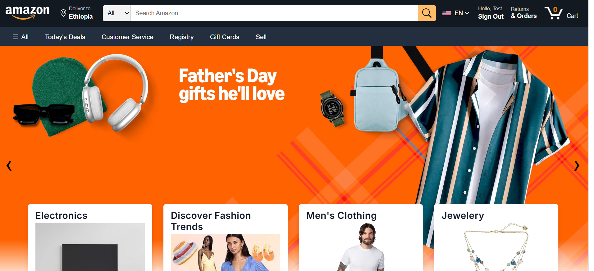

# Amazon Clone 🛒

A full-featured Amazon e-commerce clone built with React, Firebase, Stripe, and modern UI libraries. This project replicates the core shopping experience of Amazon, including authentication, product browsing, cart management, order history, and secure payments.



---

## 🚀 Features

- **User Authentication**: Sign up, sign in, and secure session management with Firebase Auth.
- **Product Catalog**: Browse products fetched from [FakeStoreAPI](https://fakestoreapi.com/), with detailed product pages.
- **Category Browsing**: Filter products by category for a seamless shopping experience.
- **Shopping Cart**: Add, remove, and update product quantities in your cart with real-time price calculation.
- **Order Placement**: Place orders and view your order history (orders stored in Firebase Firestore).
- **Stripe Payments**: Secure checkout and payment processing using Stripe.
- **Responsive UI**: Modern, mobile-friendly design inspired by Amazon.
- **Protected Routes**: Only authenticated users can access cart, orders, and payment pages.
- **Loading States**: Smooth loaders and feedback for async actions.

---

## 🛠️ Tech Stack

- **Frontend**: React, React Router, Context API, CSS Modules, MUI, React Icons
- **Backend/Database**: Firebase Auth & Firestore
- **Payments**: Stripe
- **API**: [FakeStoreAPI](https://fakestoreapi.com/)
- **Tooling**: Vite, ESLint

---

## 📦 Getting Started

### 1. Clone the repository
```bash
git clone https://github.com/your-username/amazon-clone.git
cd amazon-clone
```

### 2. Install dependencies
```bash
npm install
```

### 3. Set up Firebase
- Create a Firebase project at [firebase.google.com](https://firebase.google.com/)
- Enable Email/Password Auth and Firestore Database
- Copy your Firebase config to `firebase/firebase.js` (see code for usage of environment variables)

### 4. Set up Stripe
- Create a Stripe account at [stripe.com](https://dashboard.stripe.com/)
- Add your Stripe public key in the code (see `src/Router.jsx`)

### 5. Start the development server
```bash
npm run dev
```

Visit [http://localhost:5173](http://localhost:5173) to view the app.

---

## 📁 Folder Structure

```
Amazon_Clone/
├── public/                # Static assets (including screenshot)
├── src/
│   ├── Api/               # API configs
│   ├── assets/            # Images and icons
│   ├── components/        # Reusable UI components
│   ├── pages/             # Page components (Home, Auth, Cart, Orders, etc.)
│   ├── Utility/           # Context, reducer, types
│   ├── App.jsx            # Main app
│   ├── Router.jsx         # Routing
│   └── main.jsx           # Entry point
└── server/                # (Optional) Backend server
```

---

## 🙏 Credits
- [FakeStoreAPI](https://fakestoreapi.com/) for product data
- [Firebase](https://firebase.google.com/) for authentication and database
- [Stripe](https://stripe.com/) for payment processing
- [React Responsive Carousel](https://www.npmjs.com/package/react-responsive-carousel) for the hero slider
- [MUI](https://mui.com/) and [React Icons](https://react-icons.github.io/react-icons/) for UI components

---

## 📄 License

This project is for educational and portfolio purposes only. Not affiliated with Amazon.
